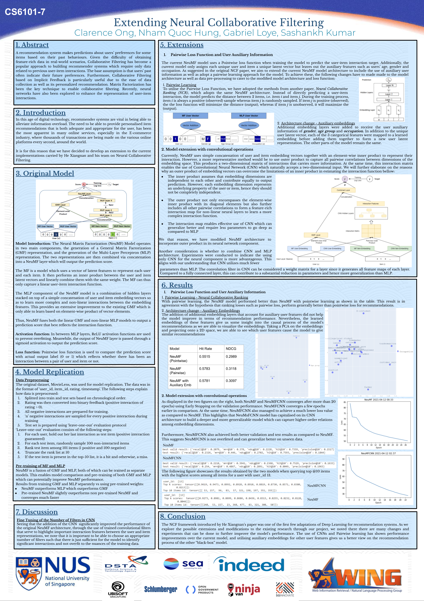

# Extending Neural Collaborative Filtering

This repository contains the code for our project on "Extending Neural Collaborative Filtering" for the CS6101 module under Prof. Min-Yen Kan.

Our codes have been adapted from the original [Neural Collaborative Filtering (NCF)](https://github.com/hexiangnan/neural_collaborative_filtering) and [Neural Collaborative Ranking (NCR)](https://github.com/Songbo729066989/NCR) respositories.

Our main experiments for NCF, Pairwise Loss, User Auxiliary Embeddings and Convolutional NCF are run in the following notebooks:

1. [ncf_script.ipynb](ncf_script.ipynb)
2. [NCR.ipynb](NCR/NCR.ipynb)
3. [ConvNCF](ConvNCF.ipynb)

Below is the poster for our project:

